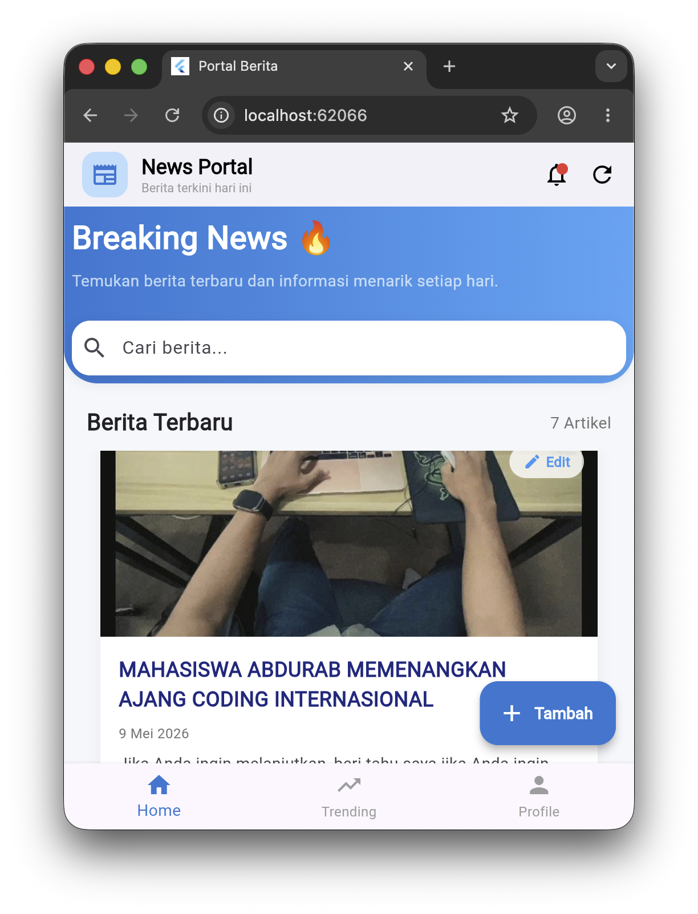
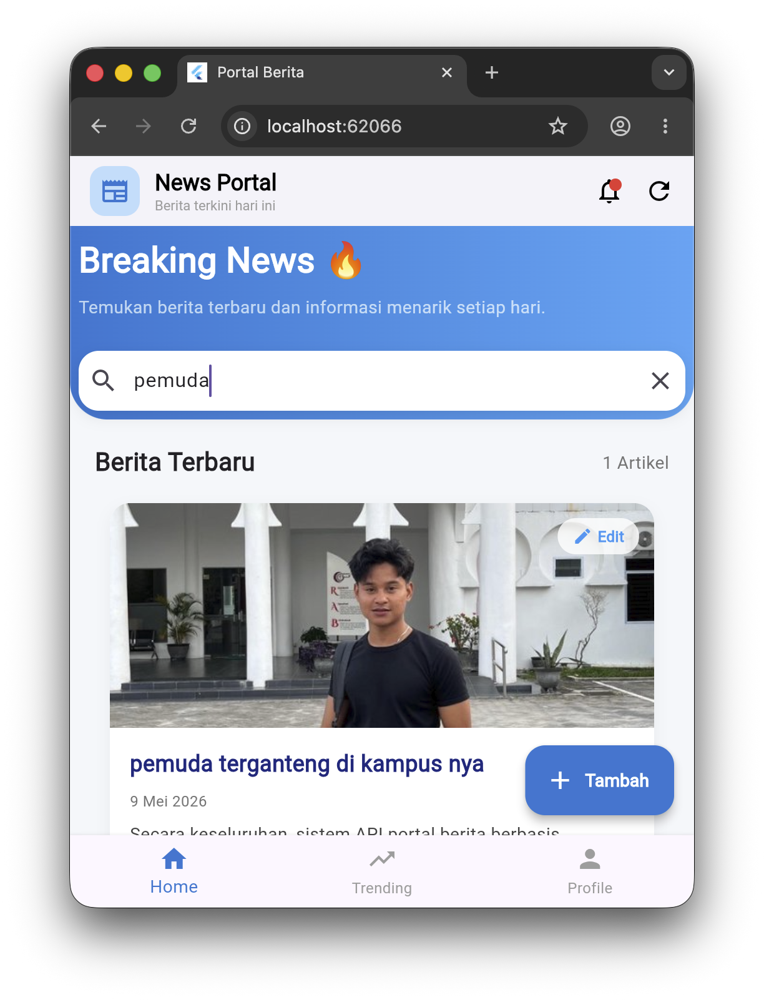
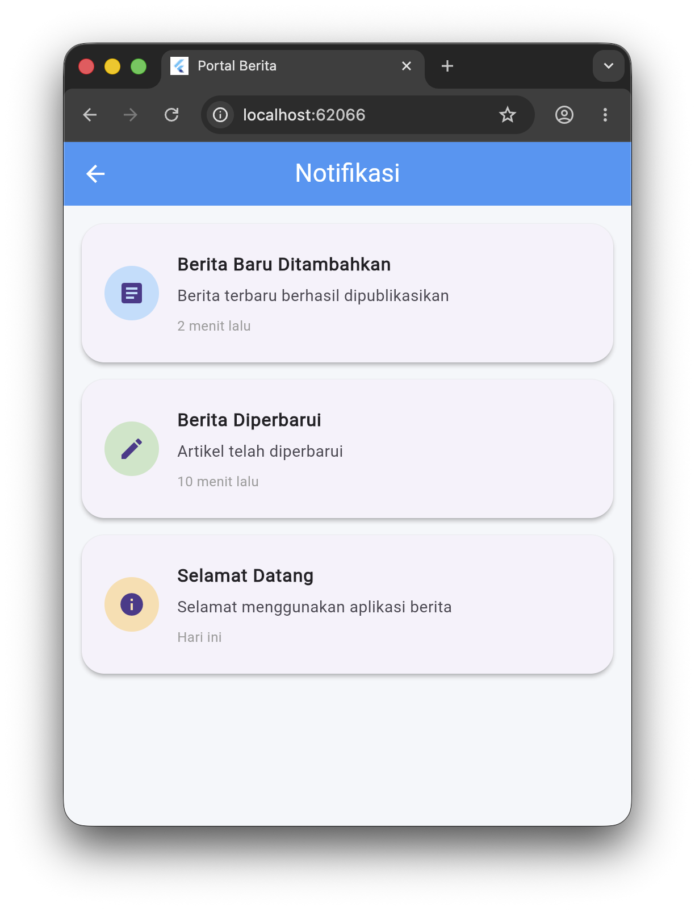

# 📰 Aplikasi Berita Sederhana (Fullstack)

Aplikasi portal berita modern yang dibangun menggunakan **CodeIgniter 4** sebagai Backend (RESTful API) dan **Flutter** sebagai Frontend (Mobile App).

---

## 📸 Tampilan Aplikasi
<!-- Ganti link gambar di bawah dengan path gambar Anda atau URL setelah di-upload ke GitHub -->

| Beranda | Detail Berita |
| :---: | :---: |
|  
|  
| 

---

## 🚀 Fitur Utama
- **Backend (API):**
  - RESTful API Berita (CRUD).
  - Integrasi Database MySQL.
  - Image Upload Management.
- **Frontend (Mobile):**
  - Menampilkan daftar berita terbaru.
  - Halaman detail berita dengan gambar.
  - UI yang responsif menggunakan Flutter.

---

## 🛠️ Teknologi yang Digunakan
- **Backend:** [CodeIgniter 4.5+](https://codeigniter.com)
- **Mobile:** [Flutter](https://flutter.dev)
- **Database:** MySQL
- **Language:** PHP 8.4, Dart

---

## ⚙️ Cara Instalasi

### 1. Backend (CI4)
1. Clone repositori ini.
2. Masuk ke folder root proyek.
3. Jalankan perintah untuk menginstal dependensi:
   ```bash
   composer update
   ```
4. Salin file `env` menjadi `.env` dan sesuaikan database Anda:
   ```bash
   cp env .env
   ```
5. Buat folder `writable` jika belum ada:
   ```bash
   mkdir -p writable/cache writable/debugbar writable/logs writable/session writable/uploads && chmod -R 777 writable
   ```
6. Jalankan server:
   ```bash
   php spark serve
   ```

### 2. Frontend (Flutter)
1. Masuk ke folder `flutter_berita_app`.
2. Jalankan perintah:
   ```bash
   flutter pub get
   ```
3. Sesuaikan `baseUrl` pada kode Flutter (biasanya di file service) ke IP laptop Anda (contoh: `http://192.168.1.5:8080`).
4. Jalankan aplikasi:
   ```bash
   flutter run
   ```

---

## 📝 Lisensi
Proyek ini dilisensikan di bawah [MIT License](LICENSE).
